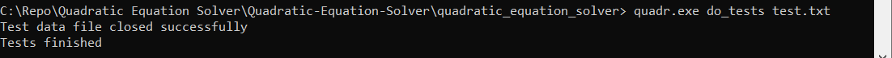
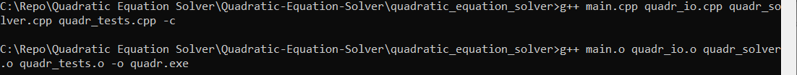

### Project title: Quadratic Equation Solver  
This program solves a quadratic equation ax^2 + bx + c = 0 over the reals.  
The program was written in C. Doxygen was used to create documentation.  
To get the solutions of the equation, type the coefficients one by one. If not a valid number was entered, the program will ask you to try again.  
Below is an example of the program`s work:

Command line argument do_tests can be used to launch unit tests after the program starts:

By default test data is read from test_eq_data.txt file. One more argument can be passed to read from another file:

###### Building project
To build the project type "g++ main.cpp quadr_io.cpp quadr_solver.cpp quadr_tests.cpp -c" without quotation marks and then "g++ main.o quadr_io.o quadr_solver.o quadr_tests.o -o *name*" without quotation marks, where *name* is the desired name for the application. See example below.

