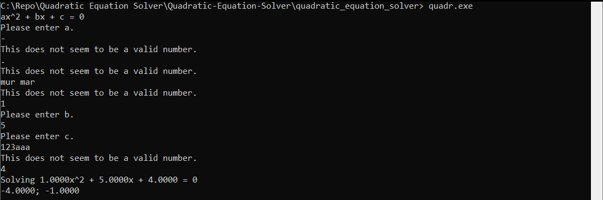
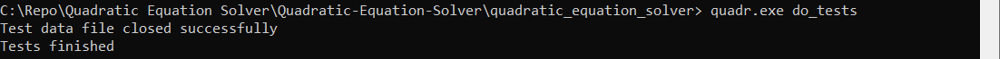

#### Project title: Quadratic Equation Solver  
This program solves a quadratic equation ax^2 + bx + c = 0 over the reals.  
The program was written in C. Doxygen was used to create documentation.  
To get the solutions of the equation, type the coefficients one by one. If not a valid number was entered, the program will ask you to try again.  
Below is an example of the program`s work:

Command line argument do_tests can be used to launch unit tests after the program starts:

